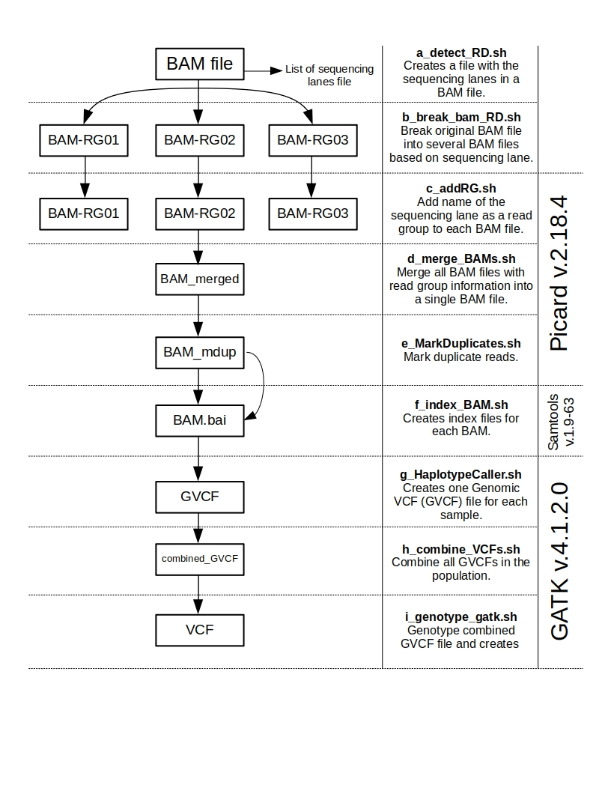

When doing the mapping we realized that all the sequencing reads from different lanes were concatenated and that information was not taken into account for the analses. Information of sequecing lane is essential to dilter duplicated reads with Picard. THerefore, we had to break the *.bam files per individual so that we add the information of the sequencing lane to later run the Picard pipelane followed by the variant calling with GATK.

---

The preprocessing steps include

1) Analysis of the quality of the reads with fastQC.
2) Clipping of Illumina adapters with Trimmomatic.
3) Mapping to reference genome with BWA
4) Preprocessing of BAM files with Picard (included in GATK)
5) Estimation of VCF files with GATK

Here I add a figure of the process.

